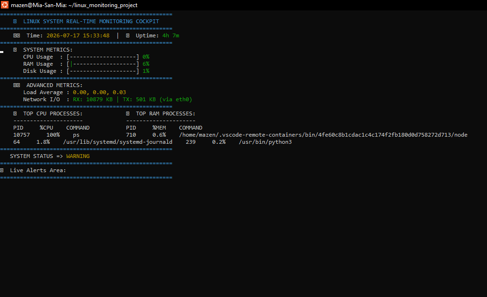
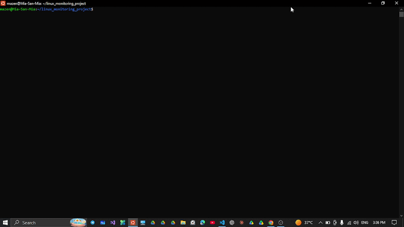

# 🚀 Linux System Real-Time Monitoring Cockpit

A lightweight, production-grade, and interactive real-time system monitoring and alerting engine built completely from scratch using **Bash** and Linux **procfs** (`/proc`). 

No external heavy agents required—just pure, high-performance shell scripting utilizing Linux internals.

---

## 📷 Dashboard Preview [Task 116 & 117]

### Live Interactive TUI Dashboard

### Live Demo Execution

---

## 🏗️ Architecture & Component Design [Task 115]

The system follows a modular, decoupled architecture that mirrors enterprise-grade monitoring tools:

linux_monitoring_project/
├── config/
│   └── config.conf              # Centralized user thresholds & refresh rate
├── data/
│   └── metrics.csv              # Historical metrics storage layer (Time-series)
├── logs/
│   └── app.log                  # Central system logs with security auditing
├── reports/
│   └── performance_report.txt   # Auto-exported daily metrics & utilization peaks
└── src/
├── collectors/              # Low-level Kernel metric collectors (CPU, RAM, Disk, Uptime, Net)
├── analyzers/               # Analytical processing engine & Top process monitors
├── alerts/                  # Stateful alerting system with custom cooldown timers
├── dashboard/               # Live interactive TUI Dashboard (tput/ANSI rendering)
└── reports/                 # Statistics engine computing historical Averages & Peaks

### 🔄 Data Flow (دورة حياة البيانات)
1. **Collect:** الـ `collectors` تقرأ البيانات الخام من الـ Kernel مباشرة (`/proc`).
2. **Store:** يتم تسجيل القيم اللحظية فوراً داخل ملف الـ `metrics.csv`.
3. **Analyze & Alert:** يقرأ الـ `analyzer` والـ `alerts` البيانات لمقارنتها بالـ Thresholds المخزنة في الـ `config.conf`.
4. **Visualize:** تقوم الـ `dashboard` بإعادة رسم الشاشة وعرض شريط التحميل والألوان بشكل حيوي وبدون وميض.

---

## ⚡ Key Features

* **Real-Time Core Metrics:** Precision monitoring of CPU (via `/proc/stat` delta calculations), Memory (`/proc/meminfo`), and Storage (`df -P`).
* **Advanced Metrics & OS Internals:** Live tracking of Server **Uptime**, **Load Average** (`/proc/loadavg`), and real-time **Network Traffic (RX/TX KB)** per active interface.
* **Smart Process Analyzer:** Dynamic detection of the Top 3 processes hogging CPU and RAM.
* **Stateful Alerting Engine:** Real-time visual warnings with a stateful **Cooldown Logic** to prevent notification flooding.
* **Time-Series Storage & Reporting:** Saves historical data to CSV, with a built-in statistics generator calculating **Averages and Peak resource utilization**.
* **Enterprise Hardening:** Zero-crash design with automated handlers for missing files, full-disk scenarios, invalid data types, and file permission locks. Verified clean via **ShellCheck**.
